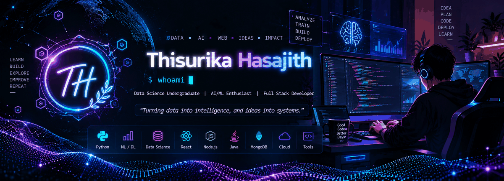

<p align="center">
  
</p>

<h1 align="center">
  Hi , I'm Thisurika Hasajith
</h1>

<h3 align="center">
  💻 Data Science Undergraduate | Full Stack Developer | AI/ML Enthusiast
</h3>

<p align="center">
  
</p>

<p align="center">
  
  
</p>

---

## About Me

<table>
<tr>
<td width="58%" valign="top">

I'm **Thisurika Hasajith** — a **Data Science undergraduate at SLIIT** with a strong interest in **Artificial Intelligence, Machine Learning, Data Science, and Full-Stack Development**.

I enjoy turning **data and ideas into practical intelligent applications**, while continuously exploring new technologies in AI and software development.

- 🤖 **Building:** AI/ML projects, RAG applications & intelligent systems
- 🧠 **Learning:** LLMs, RAG, Vector Databases & Advanced Machine Learning
- 💻 **Development:** React, Node.js, Spring Boot & Python
- 📊 **Interested in:** Data Science, AI/ML & Data Engineering
- 💬 **Ask me about:** Python, Machine Learning, Java, SQL & Web Development
- 🎯 **Goal:** Build intelligent systems that solve real-world problems
- 📫 **Email:** donthisurika@gmail.com

</td>

<td width="42%" valign="top">

```text
thisurika@github:~/profile

➜ whoami
  Thisurika Hasajith
  Data Science Undergraduate

➜ cat interests.txt
  AI / Machine Learning
  Data Science
  Full Stack Development
  Data Engineering

➜ tech --stack
  Python
  TensorFlow
  React
  Node.js
  Java
  MongoDB

➜ currently-learning
  LLMs
  RAG
  Vector Databases
  AI Systems

➜ echo $MOTTO
  Learn. Build.
  Experiment. Improve.

➜ █
```

</td>
</tr>
</table>

---

## 🛠️ My Skill Set

### 🤖 AI / ML & Data Science

<p align="center">
  
</p>

<p align="center">
  Machine Learning • Deep Learning • Scikit-learn • Pandas • NumPy • OpenCV
</p>

### 💻 Frontend

<p align="center">
  
</p>

### ⚙️ Backend

<p align="center">
  
</p>

### 🗄️ Databases

<p align="center">
  
</p>

### 🧰 Tools & DevOps

<p align="center">
  
</p>

---

## 📚 Currently Exploring

<p align="center">
  🧠 Large Language Models &nbsp; • &nbsp;
  📚 RAG &nbsp; • &nbsp;
  🔎 Vector Databases &nbsp; • &nbsp;
  🤖 AI Agents &nbsp; • &nbsp;
  📊 Machine Learning
</p>

---

## 📊 Data-Driven Insights

<p align="center">
  
  
</p>

<p align="center">
  
</p>

---

---

## 🐍 Contribution Snake Animation

<p align="center">
  
</p

---

## 🔥 Contribution Graph

<p align="center">
  
</p>

---

## 🚀 Fun Fact

> 😄 I enjoy coding, experimenting with AI, building new projects, and somehow still finding time to make my friends laugh.

---

<div align="center">

### 💡 Learn • Build • Experiment • Improve

⭐ Thanks for visiting my GitHub profile!

</div>

<p align="center">
  
</p>
